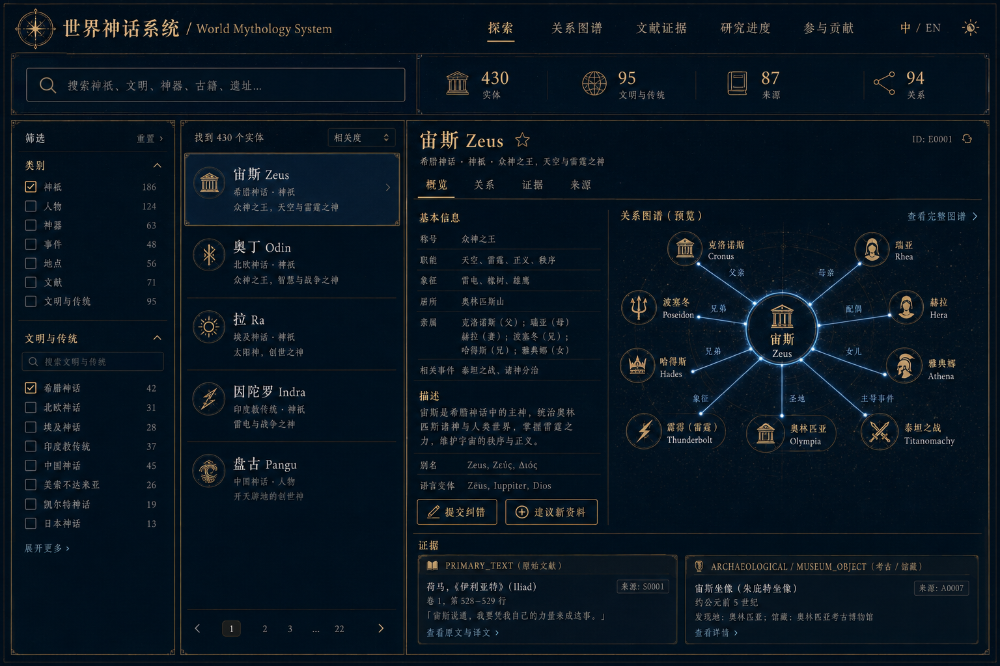

# 世界神话系统

<p align="center">
  <strong>World Mythology System</strong><br>
  跨文明 · 多语言 · 来源可追踪 · 可持续扩张
</p>

<p align="center">
  <a href="https://darenyew7527.github.io/world-mythology-system/">在线体验</a> ·
  <a href="#本地运行">本地运行</a> ·
  <a href="CONTRIBUTING.md">参与贡献</a> ·
  <a href="https://github.com/darenyew7527/world-mythology-system/discussions">中文讨论区</a> ·
  <a href="README.en.md">English</a>
</p>



> 当前公开可发现资料的**阶段性知识基线**已经建立，并且系统可以继续扩张。它不是“全部完成”的百科，也不设 `ALL COMPLETE` 终点。

世界神话系统把神祇、英雄、怪物、神器、元素、古籍、神话事件、古迹、博物馆对象与现代改编连接成一个证据感知的知识网络。每一项重要说法尽量回到原始文本、铭文、馆藏、官方遗址、学术数字版或活态传统的授权语境；互相冲突的版本可以并存。

## 现在可以做什么

- 在中文网页里搜索和筛选 448 个规范实体、95 个文明与传统。
- 从任意实体反向查看家族、神器、敌友、文献、遗址、Claims 与证据。
- 使用新增的“家谱模式”查看父母、子女、兄弟姐妹、伴侣及对应证据。
- 浏览关系图谱、159 条结构化 Claims、153 条证据和 91 条来源登记。
- 查看永久 `collection_queue`、研究缺口、显式冲突和下一轮工作。
- 通过中文 GitHub 表单提交纠错、建议新实体或补充来源。
- 运行 SQLite、JSONL、CSV、图谱导出、Markdown 档案与完整质量检查。

数据量是当前版本的检查点，不是数量上限。版本：`v0.4.0-greek-genealogy`。

v0.4.0 回应公开社区反馈，新增 Thanatos、Hypnos、Nyx、Hecate、Selene、Helios、Hestia 及其第一圈家谱。反馈只作为发现线索；所有神话断言仍需连接到《神谱》或《荷马颂歌》的具体行号。详见 [v0.4.0 发布说明](RELEASE_NOTES_v0.4.0.md)。

## 公开网页

发布 GitHub Pages 后访问：

**https://darenyew7527.github.io/world-mythology-system/**

网页默认中文，可切换英文；桌面与手机均可使用。公开快照会显示研究摘要、来源和定位符，但不会批量复制证据短引文。

## 本地运行

下载完整项目包后，先解压整个 ZIP，再在 Windows 双击 `START_WORLD_MYTHOLOGY.bat`；它使用 Windows 自带的 PowerShell 在 `127.0.0.1` 本机启动网页，不需要安装 Python。浏览器会打开 `http://127.0.0.1:8765/`，关闭启动窗口即可停止。

开发模式：

```bash
python3 scripts/generate_web_data.py
cd web
npm install
npm run dev
```

浏览器打开终端显示的地址（通常是 `http://127.0.0.1:5173/`）。

运行完整数据流水线：

```bash
python3 scripts/run_pipeline.py
python3 -m unittest discover -s tests -v
python3 scripts/privacy_release_check.py
```

数据库还不存在时才使用 `python3 scripts/run_pipeline.py --init`。日常流水线只迁移、验证和导出现有数据库，不会覆盖已经积累的研究增量；显式 `--rebuild` 仅用于恢复种子基线。

## 核心结构

| 路径 | 内容 |
|---|---|
| `database/world_mythology.sqlite` | SQLite 持久知识库 |
| `schema/schema.sql` | 可迁移到 PostgreSQL 的规范 Schema |
| `exports/jsonl/`、`exports/csv/` | 全部持久表的批量导出 |
| `exports/graph/` | 知识图谱节点与关系边 |
| `profiles/` | 按文明与实体类别生成的阅读档案 |
| `reports/` | 覆盖率、来源、冲突、缺失资料与质量报告 |
| `web/` | React/Vite 中文优先公开探索器 |
| `scripts/` | 构建、迁移、导入、验证、导出与报告自动化 |
| `tests/` | 数据持久性、图谱、来源与网页导出回归测试 |

完整入口见 [交付总索引](DELIVERY_INDEX.md)、[Schema Catalog](reports/schema_catalog.md) 与 [数据字段说明](docs/DATA_DICTIONARY.md)。

## 数据原则

1. **来源可追踪**：重要 Claim 连接到来源、章节、行号、页码、馆藏号、DOI 或手稿号。
2. **版本可并存**：不同传统与文本版本不会被压成一个“唯一答案”。
3. **不按名称粗暴合并**：别名、音译、地方版本、神祇融合和争议身份分别建模。
4. **知识层分离**：考古事实、古代文本、口述传统、现代研究、民间传说和流行文化分别标注。
5. **活态传统优先尊重社区**：记录文化权限、使用限制、自我命名和授权语境。
6. **不伪造核验**：`URL_SYNTAX_VALID` 只代表格式可解析；只有带机器回执的来源才可标为 `WEB_CONFIRMED`。

详见 [研究与证据方法](docs/METHODOLOGY.md)、[数据许可](DATA_LICENSE.md) 和逐条 [Source Registry](reports/source_registry.md)。

## 查询示例

```bash
PYTHONPATH=src python3 -m world_mythology.cli entity deity.greek.zeus
PYTHONPATH=src python3 -m world_mythology.cli network deity.norse.odin
PYTHONPATH=src python3 -m world_mythology.cli search 雷霆
PYTHONPATH=src python3 -m world_mythology.cli queue --status NEW
python3 scripts/import_queue_jsonl.py new_queue_items.jsonl        # 预检
python3 scripts/import_queue_jsonl.py new_queue_items.jsonl --apply
```

## 参与、试用与评论

- 发现名称、关系、年代或来源错误：[提交资料纠错](https://github.com/darenyew7527/world-mythology-system/issues/new?template=data-correction.yml)
- 想补充神祇、神器、怪物、古籍或遗址：[建议新实体](https://github.com/darenyew7527/world-mythology-system/issues/new?template=new-entity.yml)
- 有原始文本、馆藏号或学术资料：[建议新来源](https://github.com/darenyew7527/world-mythology-system/issues/new?template=source-suggestion.yml)
- 想讨论分类、版本差异或路线：[进入 Discussions](https://github.com/darenyew7527/world-mythology-system/discussions)

第一次参与不需要会写程序；中文内容完全可以。请先阅读 [贡献指南](CONTRIBUTING.md) 与 [行为准则](CODE_OF_CONDUCT.md)。

## 许可

- 代码：[MIT](LICENSE)
- 原创结构化元数据与研究摘要：[CC BY 4.0](DATA_LICENSE.md)
- 第三方来源、图片、现代译文及活态传统知识：保持原权利与文化权限，不由本仓库重新授权

## 项目状态

公开预览版重点是让数据可查询、可验证、可贡献和可持续维护。覆盖报告中的缺口会回流永久研究队列；局部资料缺失不会停止其他可执行工作。

如果这个项目对你有帮助，欢迎 Star、试用网页、提交 Issues 或在 Discussions 留下中文意见。
