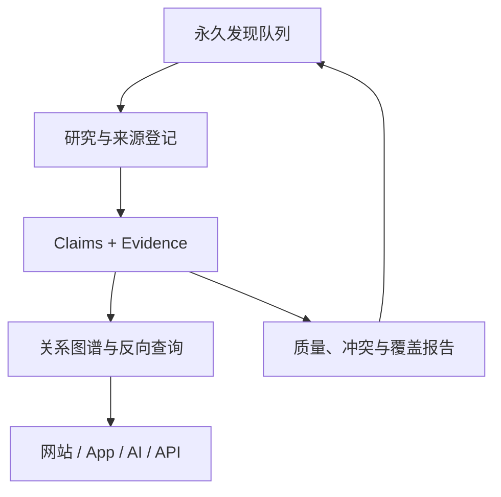

# 系统、API 与未来产品架构

## 数据流

数据库是事实核心；Markdown 是阅读投影；JSONL/CSV 是交换格式；GraphML/JSON 是图谱导出。任何阅读页面都可从数据库重新生成。

## 模块边界

- `schema/`：SQLite Schema 与未来迁移。
- `src/world_mythology/builder.py`：确定性基线构建。
- `validation.py`：完整性、证据、类型、分层与反向图检查。
- `exporter.py`：JSONL、CSV、JSON graph、GraphML。
- `reporting.py`：Markdown 档案、索引、覆盖、缺失和冲突报告。
- `maintenance.py`：别名候选、来源检查、永久队列和安全 JSONL 导入。
- `visualization/`：无写入能力的旧版静态关系网络基础。
- `web/`：React/Vite 公开探索器；默认中文、支持英文，不直接连接可写数据库。
- `scripts/generate_web_data.py`：从 SQLite 生成确定性、浏览器安全的只读快照；排除证据短引文。
- `api/openapi.yaml`：未来只读 API 契约。

## 查询路径

以 Odin 为起点时：

1. `entities` 找到稳定身份。
2. `relationship_edges_bidirectional` 同时返回存储 claim 与推导反向边。
3. `claims` 说明每条边属于哪个传统、版本和证据强度。
4. `evidence → sources` 回到《埃达》版本、手稿、章节或博物馆对象。
5. `collection_queue` 返回尚未完成的 Borr、Bestla、Mímir、神器制造者等扩张任务。

## API 原则

- 默认只返回古代／传统层；现代改编需显式 `knowledge_layer` 过滤。
- 所有 claim 返回 `review_status`、`assertion_scope`、`knowledge_layer` 和 evidence 链。
- 图谱反向边标注 `is_inferred_inverse`，客户端不会误以为它是第二条独立来源。
- 搜索返回候选而不是自动合并结果。
- 活态/受限知识在未来服务层执行社群与权限策略。
- 写入 API 使用追加式研究 session 和 optimistic concurrency；第一轮 API 仅设计、未部署。
- GitHub Pages 只部署构建后的静态文件；纠错和资料建议通过可审计的 Issues／Discussions 回流，而不是由浏览器直接改库。

## PostgreSQL 迁移

稳定字符串 ID、应用层 Unicode 标准化、ISO-8601 UTC、lookup table 和普通 FK 均避免依赖 SQLite 特性。迁移时：

- JSON 文本可升级为 `jsonb`，但核心 claim 仍保持关系结构。
- 建立 `tsvector` 多语言搜索和 pg_trgm 候选匹配。
- 研究队列使用 `FOR UPDATE SKIP LOCKED` 批次领取。
- 加入 materialized graph views、PostGIS 地图与时间范围类型。
- 运行实际 PostgreSQL smoke migration；SQLite 通过不等于迁移完成。

## 产品扩展

同一核心可支持神祇家族树、神器百科、世界地图、古迹地图、文本阅读器、文明与事件时间线、雷神／洪水／冥界／创世对比、AI 神话助手、教育系统和原典—影视游戏对照。产品层不能绕过 claim/evidence 和文化权限层。
