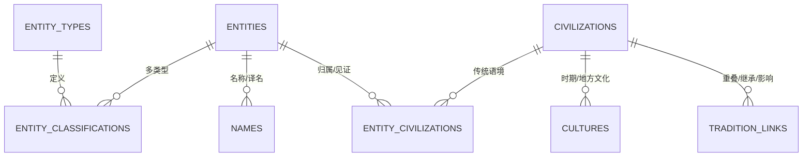
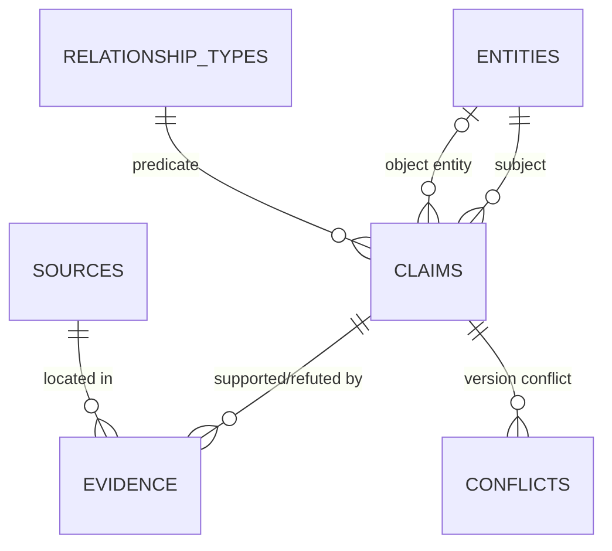
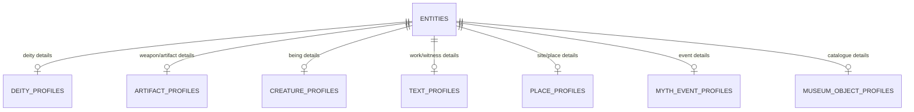
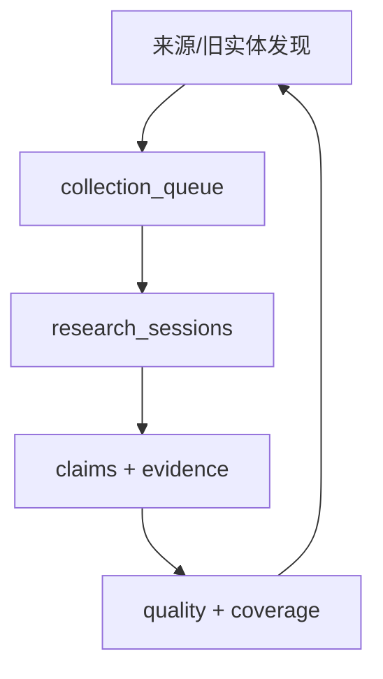

# 核心实体关系架构 / ERD

完整的 43 张持久表、32 个视图、字段、外键与 SQL 定义见 `reports/schema_catalog.md`。本页只展示最关键的数据流，避免把完整 Schema 压成一张不可读的大图。

## 身份、类型与文明语境

一个实体可同时属于多个类型和传统。例如 Ma’at 可同时标记 `DEITY` 与 `CONCEPT`；Ymir 以 `GIANT` 为主类型，同时保留原初存在分类。类型重叠不会自动合并实体。

## Claim、Evidence 与知识图谱

`relationships` 不是第二套物理事实表，而是从实体对象 claim 投影出的只读视图。`relationship_edges_bidirectional` 再根据 inverse 或 symmetric 规则生成反向查询边；每条边仍可回到原 claim、review status、knowledge layer 和 evidence。

## 类型专项档案

专项表保存结构性字段；复杂、版本化或可争议叙述进入 claims。现代作品和古代原型分别建实体，通过 `modern_adaptations` 连接，避免流行文化设定污染古代材料。

## 永久队列与质量闭环

队列按有限批次运行，但永久保存候选、发现路径和状态历史。局部失败写入审计记录，不会让其余队列永久停止。Coverage 仅说明当前登记基线，不计算“全世界神话完成率”。
